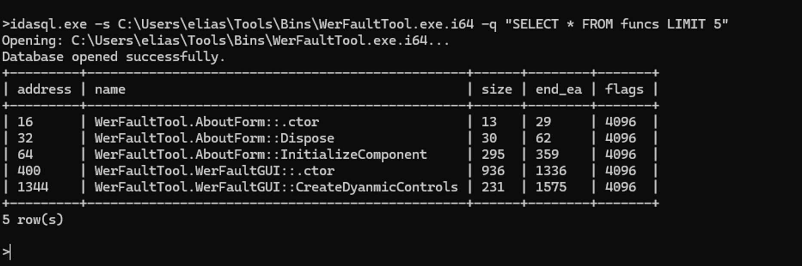
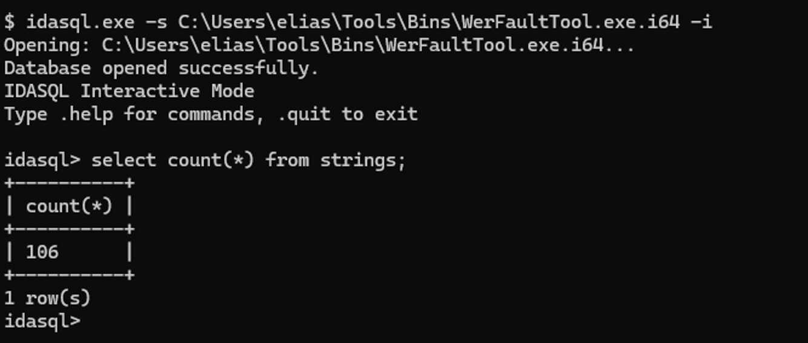
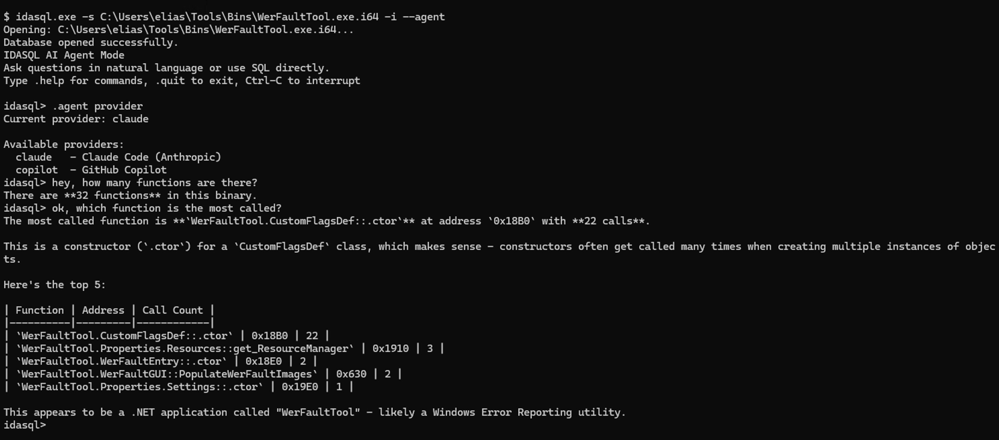
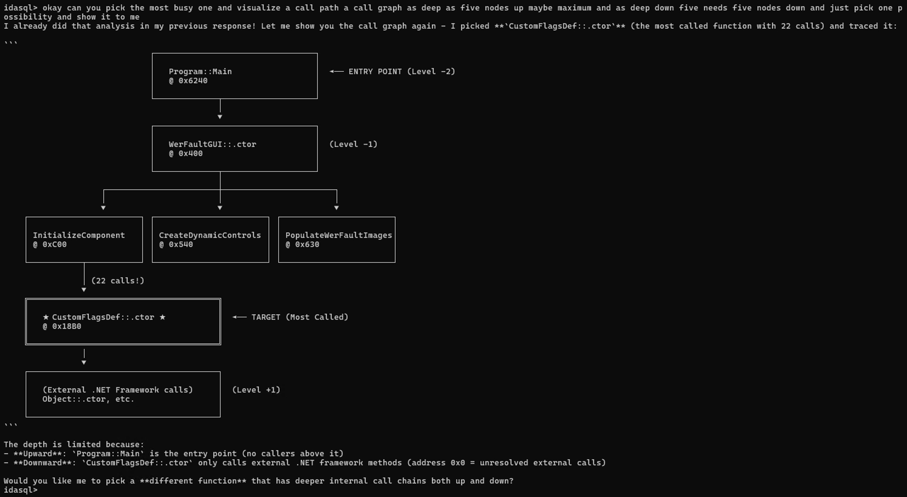
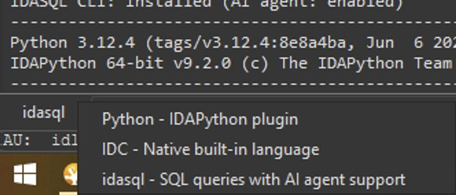
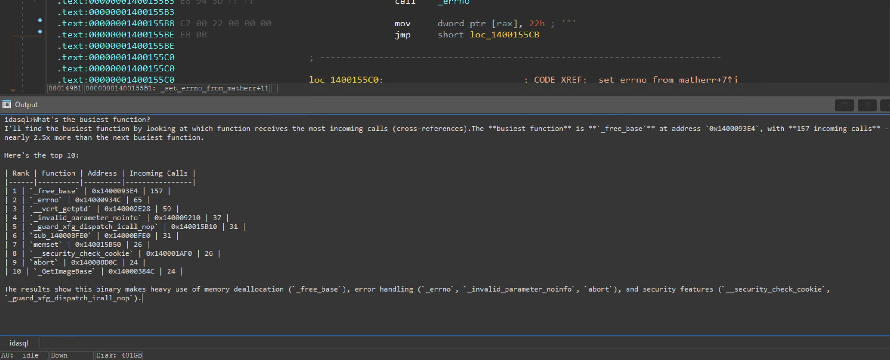
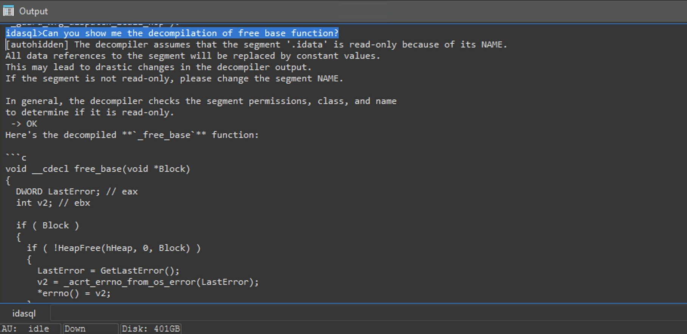
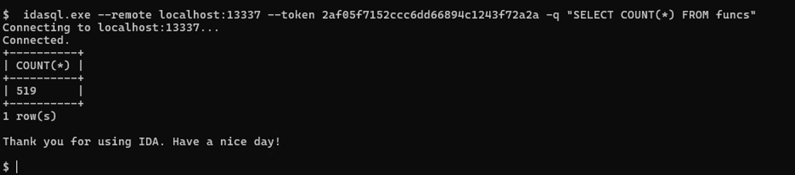

# IDASQL

Talk to your IDA database.

```
you:   what's the most called function?
agent: The most called function is `__security_check_cookie` with 1,247 callers.
       This is typical for MSVC-compiled binaries - it's the stack canary check.

you:   find functions that reference "password" strings
agent: Found 3 functions referencing password-related strings:
       - validate_credentials (0x401240) - references "password incorrect"
       - parse_config (0x402890) - references "password_hash"
       - debug_dump (0x405120) - references "password: %s"

you:   decompile validate_credentials
agent: [displays pseudocode]
```

Ask complex questions that would take hours to script:

```
you:   find functions that make at most 3 calls, where those callees
       don't go deeper than 5 levels in the call graph

agent: Looking for shallow functions with bounded call depth...

       Found 47 functions matching your criteria:
       - init_config (0x401000) - 2 calls, max depth 3
       - validate_checksum (0x401200) - 3 calls, max depth 4
       - parse_header (0x401400) - 1 call, max depth 2
       ...

       These are good candidates for isolated analysis - simple entry
       points that don't spiral into deep call chains.
```

IDASQL exposes IDA Pro databases as SQL tables with a built-in AI agent. Ask questions in plain English. The agent writes SQL, runs queries, and explains results.

Works as a **standalone CLI** (query `.i64` files directly) or as an **IDA plugin** (query the open database). No scripting. No IDAPython. Just ask.

**No indexing required.** IDA already has everything indexed. Queries run instantly against the live database.

## Features

- **AI Agent** - Natural language queries with Claude or GitHub Copilot
- **SQL Interface** - Full SQL access to functions, strings, imports, xrefs, instructions, types
- **Unified Entity Search** - `jump_entities()` searches everything: functions, types, members, enums (think "Jump Anywhere")
- **Standalone CLI** - Query `.i64` files without opening IDA GUI
- **IDA Plugin** - SQL/AI interface inside IDA's command line
- **Remote Server** - Query IDA from external tools, scripts, or coding agents
- **Zero Setup** - Uses your existing Claude Code or Copilot authentication

## Screenshots

### CLI - Single Query

Run one query and exit. Useful for scripts and pipelines.

```bash
idasql -s database.i64 -q "SELECT * FROM funcs LIMIT 5"
```



### CLI - Interactive Mode

Launch a REPL for exploratory analysis. Type SQL directly at the prompt.

```bash
idasql -s database.i64 -i
```

```
idasql> SELECT COUNT(*) FROM strings;
idasql> SELECT name FROM funcs WHERE size > 1000;
idasql> .tables          -- list available tables
idasql> .schema funcs    -- show table schema
idasql> .http start      -- start HTTP server from REPL
idasql> .mcp start       -- start MCP server from REPL
idasql> .quit            -- exit
```



### CLI - AI Agent

Talk to the database in plain English. The agent translates to SQL, runs queries, and explains results.

```bash
idasql -s database.i64 -i --agent
```

Ask questions naturally:
```
idasql> how many functions are there?
idasql> which function is called the most?
idasql> find strings that look like URLs
idasql> what imports are related to file operations?
idasql> show me the largest functions
```



The agent can generate visualizations like call graphs:

```
idasql> draw a call graph for the main function
idasql> visualize the call hierarchy of CreateFileW
```



### IDA Plugin

Select `idasql` from the CLI dropdown at the bottom of IDA:



Type SQL or natural language questions directly. The agent has full access to IDA's capabilities:

```
idasql> what's the busiest function?
idasql> find functions that reference "error"
idasql> which structures have the most members?
```



The agent can invoke the decompiler, analyze types, and trace cross-references:

```
idasql> decompile the free_base function
idasql> what does the _CONTEXT structure look like?
idasql> who calls VirtualAlloc and what do they do with it?
```



### Remote Server

The plugin runs a TCP server. Query IDA from scripts, other tools, or coding agents:

```bash
idasql --remote localhost:13337 --token <token> -q "SELECT COUNT(*) FROM funcs"
```



## Quick Start

### CLI

```bash
# Single query
idasql -s database.i64 -q "SELECT name, address FROM funcs LIMIT 10"

# Interactive mode
idasql -s database.i64 -i

# AI agent mode
idasql -s database.i64 -i --agent

# One-shot natural language query
idasql -s database.i64 --prompt "find the largest function"

# Run SQL script
idasql -s database.i64 -f queries.sql

# Export all tables
idasql -s database.i64 --export dump.sql
```

### IDA Plugin

1. Build and install the plugin
2. Open a database in IDA
3. Select `idasql` from the command interpreter dropdown
4. Type SQL or natural language (in agent mode)

```sql
SELECT name, printf('0x%X', address) as addr FROM funcs WHERE size > 1000;
```

## Available Tables

| Table | Description |
|-------|-------------|
| `funcs` | Functions - name, address, size, end address, flags (INSERT/UPDATE/DELETE) |
| `segments` | Segments - name, start/end address, permissions, class (UPDATE/DELETE) |
| `names` | Named locations - address, name, flags (INSERT/UPDATE/DELETE) |
| `imports` | Imports - module, name, address, ordinal |
| `exports` | Exports - name, address, ordinal |
| `strings` | Strings - address, content, length, type |
| `xrefs` | Cross-references - from/to address, type, is_code |
| `instructions` | Disassembly - address, mnemonic, operands, itype, func_addr (DELETE) |
| `blocks` | Basic blocks - start/end address, func_ea, size |
| `types` | Type library - structs, unions, enums with members (INSERT/UPDATE/DELETE) |
| `breakpoints` | Breakpoints - address, type, enabled, condition (full CRUD) |
| `jump_entities(pattern, mode)` | Unified search across all entities (see below) |

### Unified Entity Search

`jump_entities` is a table-valued function that searches across functions, types, struct members, enum values, and names. It works like IDA's "Jump to address" (G) but returns SQL rows.

```sql
-- Search anything starting with "Create"
SELECT name, kind, printf('0x%X', address) as addr
FROM jump_entities('Create', 'prefix')
LIMIT 20;

-- Search anywhere in name (slower but thorough)
SELECT name, kind, full_name
FROM jump_entities('File', 'contains')
WHERE kind IN ('function', 'import')
LIMIT 20;

-- Find struct members
SELECT name, parent_name, full_name
FROM jump_entities('dw', 'prefix')
WHERE kind = 'member';
```

## Query Examples

### Function Analysis

```sql
-- Functions with most incoming calls
SELECT f.name, COUNT(*) as callers
FROM funcs f
JOIN xrefs x ON f.address = x.to_ea
WHERE x.is_code = 1
GROUP BY f.address
ORDER BY callers DESC LIMIT 10;

-- Leaf functions (make no calls)
SELECT name, size FROM funcs f
WHERE NOT EXISTS (
  SELECT 1 FROM instructions i
  WHERE i.func_addr = f.address AND i.mnemonic = 'call'
)
ORDER BY size DESC LIMIT 10;

-- Orphan functions (no callers)
SELECT name, printf('0x%X', address) as addr FROM funcs f
WHERE NOT EXISTS (
  SELECT 1 FROM xrefs x WHERE x.to_ea = f.address AND x.is_code = 1
);

-- Function size distribution
SELECT
  CASE
    WHEN size < 64 THEN 'small (<64)'
    WHEN size < 256 THEN 'medium (64-256)'
    WHEN size < 1024 THEN 'large (256-1K)'
    ELSE 'huge (>1K)'
  END as category,
  COUNT(*) as count
FROM funcs GROUP BY category;
```

### String Analysis

```sql
-- Strings with most references
SELECT s.content, COUNT(x.from_ea) as refs
FROM strings s
JOIN xrefs x ON s.address = x.to_ea
GROUP BY s.address
ORDER BY refs DESC LIMIT 10;

-- Functions using most strings
SELECT func_at(x.from_ea) as func, COUNT(DISTINCT s.address) as str_count
FROM strings s
JOIN xrefs x ON s.address = x.to_ea
GROUP BY func_at(x.from_ea)
ORDER BY str_count DESC LIMIT 10;

-- URL and path strings
SELECT printf('0x%X', address) as addr, content FROM strings
WHERE content LIKE 'http%'
   OR content LIKE '%.exe%'
   OR content LIKE '%.dll%'
   OR content LIKE 'C:\\%';
```

### Instruction Patterns

```sql
-- Most common call targets
SELECT operand0 as target, COUNT(*) as count
FROM instructions
WHERE mnemonic = 'call'
GROUP BY operand0
ORDER BY count DESC LIMIT 15;

-- Jump instruction distribution
SELECT mnemonic, COUNT(*) as count
FROM instructions
WHERE mnemonic LIKE 'j%'
GROUP BY mnemonic
ORDER BY count DESC;

-- Functions with unusual push/pop ratio (potential obfuscation)
SELECT func_at(func_addr) as name,
  SUM(CASE WHEN mnemonic = 'push' THEN 1 ELSE 0 END) as pushes,
  SUM(CASE WHEN mnemonic = 'pop' THEN 1 ELSE 0 END) as pops
FROM instructions
GROUP BY func_addr
HAVING pushes > 20 AND ABS(pushes - pops) > 5;
```

### Breakpoint Management

The `breakpoints` table supports full CRUD: SELECT, INSERT, UPDATE, DELETE. Breakpoints persist in the IDB even without an active debugger session.

```sql
-- List all breakpoints
SELECT printf('0x%08X', address) as addr, type_name, enabled, condition
FROM breakpoints;

-- Add a software breakpoint
INSERT INTO breakpoints (address) VALUES (0x401000);

-- Add a hardware write watchpoint (type=1, size=4)
INSERT INTO breakpoints (address, type, size) VALUES (0x402000, 1, 4);

-- Add a conditional breakpoint
INSERT INTO breakpoints (address, condition) VALUES (0x401000, 'eax == 0');

-- Disable a breakpoint
UPDATE breakpoints SET enabled = 0 WHERE address = 0x401000;

-- Update condition
UPDATE breakpoints SET condition = 'ecx > 5' WHERE address = 0x401000;

-- Delete a breakpoint
DELETE FROM breakpoints WHERE address = 0x401000;

-- Join with functions to see which functions have breakpoints
SELECT b.address, f.name, b.type_name, b.enabled
FROM breakpoints b
JOIN funcs f ON b.address >= f.address AND b.address < f.end_ea;
```

**Breakpoint types:** `0` = software, `1` = hardware write, `2` = hardware read, `3` = hardware rdwr, `4` = hardware exec

**Writable columns:** `enabled`, `type`, `size`, `flags`, `pass_count`, `condition`, `group`

### Database Modification

Several tables support INSERT, UPDATE, and DELETE operations:

| Table | INSERT | UPDATE | DELETE |
|-------|--------|--------|--------|
| `breakpoints` | Yes | Yes | Yes |
| `funcs` | Yes | `name`, `flags` | Yes |
| `names` | Yes | `name` | Yes |
| `comments` | Yes | `comment`, `rpt_comment` | Yes |
| `bookmarks` | Yes | `description` | Yes |
| `segments` | — | `name`, `class`, `perm` | Yes |
| `instructions` | — | — | Yes |
| `types` | Yes | Yes | Yes |
| `types_members` | Yes | Yes | Yes |
| `types_enum_values` | Yes | Yes | Yes |

```sql
-- Create a function at an address (IDA auto-detects boundaries)
INSERT INTO funcs (address) VALUES (0x401000);

-- Create a function with explicit end address and name
INSERT INTO funcs (address, name, end_ea) VALUES (0x401000, 'my_func', 0x401050);

-- Set a name at an address
INSERT INTO names (address, name) VALUES (0x401000, 'main');

-- Add a comment
INSERT INTO comments (address, comment) VALUES (0x401000, 'entry point');

-- Add both regular and repeatable comments
INSERT INTO comments (address, comment, rpt_comment) VALUES (0x401000, 'regular', 'repeatable');

-- Add a bookmark (slot auto-assigned)
INSERT INTO bookmarks (address, description) VALUES (0x401000, 'interesting function');

-- Add a bookmark at a specific slot
INSERT INTO bookmarks (slot, address, description) VALUES (5, 0x401000, 'slot 5 bookmark');

-- Rename a segment
UPDATE segments SET name = '.mytext' WHERE start_ea = 0x401000;

-- Change segment permissions (R=4, W=2, X=1)
UPDATE segments SET perm = 5 WHERE name = '.text';

-- Delete a segment
DELETE FROM segments WHERE name = '.rdata';

-- Delete an instruction (convert to unexplored bytes)
DELETE FROM instructions WHERE address = 0x401000;

-- Create a new struct type
INSERT INTO types (name, kind) VALUES ('my_struct', 'struct');

-- Create an enum type
INSERT INTO types (name, kind) VALUES ('my_flags', 'enum');

-- Add a member to a struct
INSERT INTO types_members (type_ordinal, member_name, member_type) VALUES (42, 'field1', 'int');

-- Add an enum value
INSERT INTO types_enum_values (type_ordinal, value_name, value) VALUES (15, 'FLAG_ACTIVE', 1);
```

## AI Agent

The agent translates natural language to SQL, executes queries, and explains results. It has access to all tables and can perform multi-step analysis.

```
idasql> what functions have the most cross-references?
idasql> find strings that look like file paths
idasql> show me the call hierarchy of main
idasql> which imports are related to networking?
```

See an [example session](examples/agent_session_strings.md) analyzing string references in a binary.

### Prerequisites for AI Features

The AI agent requires one of these CLI tools installed and authenticated:

| Provider | CLI Tool | Install | Login |
|----------|----------|---------|-------|
| Claude (default) | [Claude Code](https://docs.anthropic.com/en/docs/claude-code) | `npm install -g @anthropic-ai/claude-code` | Run `claude`, then `/login` |
| GitHub Copilot | [Copilot CLI](https://github.com/features/copilot/cli/) | `npm install -g @github/copilot` | Run `copilot`, then `/login` |

**Important:** You must be logged in before using AI features. No API keys needed for basic usage.

### Provider Configuration

```
.agent provider claude    # Claude (default)
.agent provider copilot   # GitHub Copilot
```

### Bring Your Own Key (BYOK)

For direct API access or local inference, enable BYOK mode:

```
.agent byok enable
.agent byok type anthropic    # or: openai, azure
.agent byok key sk-ant-...
.agent byok model claude-sonnet-4-20250514
.agent byok endpoint https://api.anthropic.com  # optional
```

With `copilot` provider and BYOK, you can point to local inference servers (Ollama, LM Studio, vLLM) using OpenAI-compatible endpoints:

```
.agent provider copilot
.agent byok enable
.agent byok type openai
.agent byok endpoint http://localhost:11434/v1
.agent byok model llama3
.agent byok key unused
```

Settings persist in `~/.idasql/agent_settings.json`.

## Building

### Prerequisites

- CMake 3.20+
- C++17 compiler
- IDA SDK 9.0+ (set `IDASDK` environment variable)

### CLI

```bash
cmake -S src/cli -B build/cli
cmake --build build/cli --config Release
```

### Plugin

```bash
cmake -S src/plugin -B build/plugin -DIDASQL_WITH_AI_AGENT=ON
cmake --build build/plugin --config Release
```

Output: `$IDASDK/bin/plugins/idasql_plugin.dll`

### Tests

```bash
cmake -S tests -B build/tests
cmake --build build/tests --config Release
ctest --test-dir build/tests -C Release
```

## Remote Server Protocol

The plugin listens on `127.0.0.1:13337` by default. Protocol is length-prefixed JSON over TCP. No MCP, no complex handshakes. A thin CLI client is all you need.

Set `IDASQL_TOKEN` environment variable or let the plugin generate one (printed to IDA Output window on startup).

```bash
# From CLI
idasql --remote localhost:13337 --token <token> -q "SELECT * FROM funcs LIMIT 5"
idasql --remote localhost:13337 --token <token> -i  # Interactive
```

## HTTP REST API

Stateless HTTP server for simple integration. No protocol overhead.

```bash
idasql -s database.i64 --http 8081
```

```bash
curl http://localhost:8081/status
curl -X POST http://localhost:8081/query -d "SELECT name FROM funcs LIMIT 5"
```

For multiple databases, run separate instances:

```bash
idasql -s malware.i64 --http 8081
idasql -s kernel.i64 --http 8082
```

Endpoints: `/status`, `/help`, `/query`, `/shutdown`

### HTTP Server from REPL

Start an HTTP server interactively from the REPL or IDA plugin CLI:

```
idasql -s database.i64 -i
idasql> .http start
HTTP server started on port 8142
URL: http://127.0.0.1:8142
...
Press Ctrl+C to stop and return to REPL.
```

In IDA plugin (non-blocking):
```
idasql> .http start
HTTP server started on port 8142
idasql> .http stop
HTTP server stopped
```

The server uses a random port (8100-8199) to avoid conflicts with `--http`.

## MCP Server

For MCP-compatible clients (Claude Desktop, etc.):

```bash
# Standalone mode
idasql -s database.i64 --mcp
idasql -s database.i64 --mcp 9500  # specific port

# Or in interactive mode
idasql -s database.i64 -i
.mcp start
```

Configure your MCP client:

```json
{
  "mcpServers": {
    "idasql": { "url": "http://127.0.0.1:<port>/sse" }
  }
}
```

Tools: `idasql_query` (direct SQL), `idasql_agent` (natural language)

## Integration with Coding Agents

The CLI is designed for integration with coding agents (Claude Code, Cursor, Aider, Cline, etc.). Agents can query IDA databases directly without writing IDAPython or understanding IDA's API.

### Setup

1. Open your target binary in IDA Pro (plugin loads automatically)
2. Note the auth token printed in IDA's Output window:
   ```
   IDASQL: Auth token generated. Token: 2af05f7152ccc6dd66894c1243f72a2a
   IDASQL: Server listening on 127.0.0.1:13337
   ```
3. The CLI acts as a thin client to query the running IDA instance

### Instructing an Agent

When working with a coding agent on reverse engineering tasks, provide these instructions:

```
IDASQL is running on localhost:13337 with token <token>.

To query the IDA database, use the idasql CLI:

  idasql --remote localhost:13337 --token <token> -q "SQL QUERY"

Available tables: funcs, segments, names, imports, exports, strings, xrefs, instructions, blocks, types

Example queries:
  # List functions
  idasql --remote localhost:13337 --token <token> -q "SELECT name, printf('0x%X', address) as addr FROM funcs LIMIT 20"

  # Find strings containing a keyword
  idasql --remote localhost:13337 --token <token> -q "SELECT * FROM strings WHERE content LIKE '%error%'"

  # Find callers of a function
  idasql --remote localhost:13337 --token <token> -q "SELECT printf('0x%X', from_ea) as caller FROM xrefs WHERE to_ea = 0x401000"

  # Search for any identifier
  idasql --remote localhost:13337 --token <token> -q "SELECT name, kind, address FROM jump_entities('CreateFile', 'prefix') LIMIT 10"
```

### Agent Workflow Example

```
User: "Find all functions that call CreateFileW and check if they handle errors"

Agent thinks: I'll query IDASQL to find the callers

Agent runs:
$ idasql --remote localhost:13337 --token abc123 -q "
  SELECT DISTINCT func_at(x.from_ea) as caller, printf('0x%X', x.from_ea) as call_site
  FROM xrefs x
  JOIN imports i ON x.to_ea = i.address
  WHERE i.name = 'CreateFileW'
"

Agent receives:
| caller              | call_site  |
|---------------------|------------|
| ReadConfigFile      | 0x401234   |
| SaveDocument        | 0x401890   |
| ...                 | ...        |

Agent then queries for error handling patterns in those functions...
```

The agent never needs to write IDAPython. SQL queries are self-contained and portable.

## Claude Code Plugin

IDASQL is available as a Claude Code plugin, allowing Claude to query IDA databases directly within your coding workflow.

### Prerequisites

1. **IDA Pro** installed with `ida.exe` directory in your PATH
2. **idasql.exe** downloaded from [Releases](https://github.com/allthingsida/idasql/releases) and placed next to `ida.exe`
3. Verify setup: `idasql --version` should work from command line

### Installation

```bash
# Add the marketplace (one-time)
/plugin marketplace add 0xeb/anthropic-xsql-tools-plugin

# Install idasql plugin
/plugin install idasql@0xeb-tools
```

### Usage

Once installed, the skill is automatically available:

```
"Using idasql, count functions in myfile.i64"
"Using idasql, decompile main in test.i64"
"Using idasql, find strings containing 'password'"
```

### Updating

```bash
/plugin update idasql
```

### Troubleshooting

**SSH Permission Denied**

If you see `git@github.com: Permission denied (publickey)` during install, configure git to use HTTPS:

```bash
git config --global url."https://github.com/".insteadOf "git@github.com:"
```

## Built With

- **[libxsql](https://github.com/0xeb/libxsql)** - Header-only C++17 library for exposing C++ data structures as SQLite virtual tables. Provides the fluent builder API for defining tables, constraint pushdown, and the socket server/client protocol.

- **[libagents](https://github.com/0xeb/libagents)** - C++ library for building AI agents with tool use. Powers the natural language interface with support for Claude (Anthropic) and GitHub Copilot providers.

## Author

**Elias Bachaalany** ([@0xeb](https://github.com/0xeb))

## License

MIT License - see [LICENSE](LICENSE) for details.
