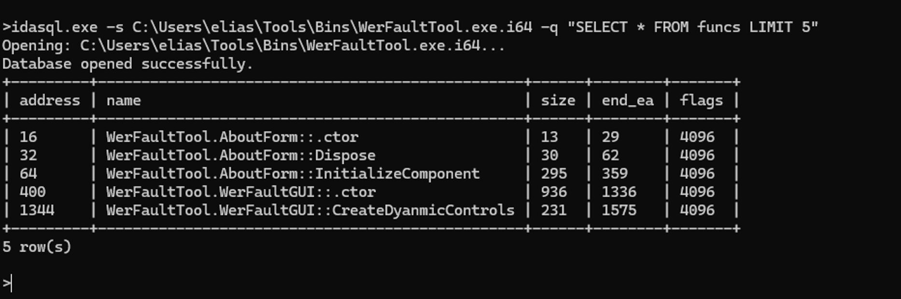
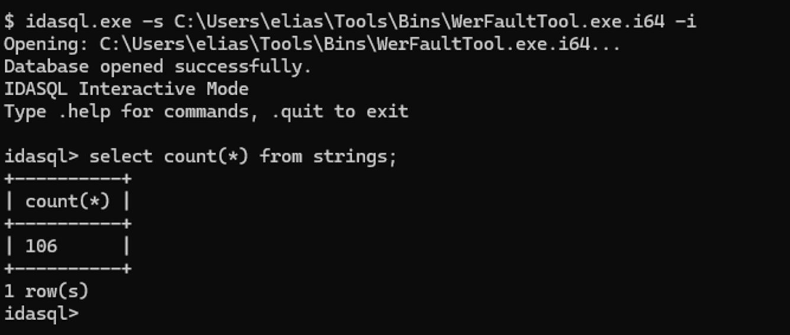
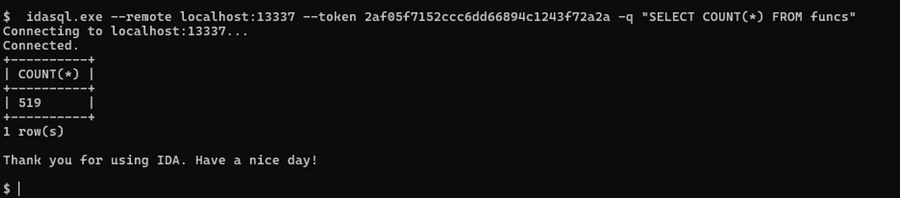
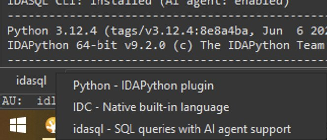
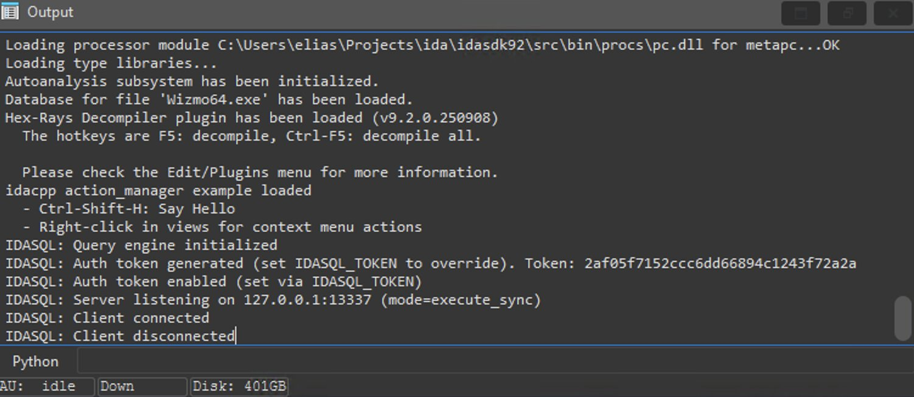

# IDASQL

Query IDA Pro databases with SQL.

```
you:       /idasql analyze this binary; tell me the most called function
assistant: __security_check_cookie has the highest fan-in (1,247 callers).
           It is likely the compiler stack-cookie check used by MSVC.
```

Use any workflow you prefer:
- Run SQL directly in `idasql`
- Use `.http`/`--http` for stateless automation
- Use `.mcp`/`--mcp` when built with `-DIDASQL_WITH_MCP=ON`
- Pair with your favorite coding CLI and the `/idasql` skill

IDASQL exposes IDA Pro databases as SQL tables.

Works as a **standalone CLI** (query `.i64` files directly) or as an **IDA plugin** (query the open database). No scripting. No IDAPython. Just SQL.

**No indexing required.** IDA already has everything indexed. Queries run instantly against the live database.

## Features

- **SQL Interface** - Full SQL access to functions, strings, imports, xrefs, instructions, types
- **Unified Entity Search** - `grep` table + `grep()` function search functions, labels, segments, types, members, and enums
- **Standalone CLI** - Query `.i64` files without opening IDA GUI
- **IDA Plugin** - SQL interface inside IDA's command line
- **Remote Server** - Query IDA from external tools via HTTP or MCP
- **Optional MCP** - Build-time flag (`-DIDASQL_WITH_MCP=ON`), off by default

## Screenshots

### CLI - Single Query

Run one query and exit. Useful for scripts and pipelines.

```bash
idasql -s database.i64 -q "SELECT * FROM funcs LIMIT 5"
```



### CLI - Interactive Mode

Launch a REPL for exploratory analysis. Type SQL directly at the prompt.

```bash
idasql -s database.i64 -i
```

```
idasql> SELECT COUNT(*) FROM strings;
idasql> SELECT name FROM funcs WHERE size > 1000;
idasql> .tables          -- list available tables
idasql> .schema funcs    -- show table schema
idasql> .http start      -- start HTTP server from REPL
idasql> .mcp start       -- start MCP server from REPL (if built with MCP)
idasql> .quit            -- exit
```



### Skill Workflow (External CLI)

```bash
idasql -s database.i64 --http 8081
# or, if built with -DIDASQL_WITH_MCP=ON:
idasql -s database.i64 --mcp
```

In your favorite coding CLI, use the `/idasql` skill:
```
/idasql analyze this binary; tell me the most called functions.
/idasql find functions that reference "password" strings and rank by xrefs.
/idasql show callers of CreateFileW and summarize error handling.
```



### IDA Plugin

Select `idasql` from the CLI dropdown at the bottom of IDA:



Type SQL directly, or expose the open database through `.http` / `.mcp` for external tooling:

```
idasql> SELECT name, size FROM funcs ORDER BY size DESC LIMIT 10;
idasql> .http start
idasql> .mcp start
```



### HTTP Server

The plugin can run an HTTP server for scripting and tooling workflows:

```bash
idasql -s database.i64 --http 8081 --token <token>
curl -X POST http://127.0.0.1:8081/query -H "Authorization: Bearer <token>" -d "SELECT COUNT(*) FROM funcs"
```

## Quick Start

### CLI

```bash
# Single query
idasql -s database.i64 -q "SELECT name, address FROM funcs LIMIT 10"

# Interactive mode
idasql -s database.i64 -i

# Run SQL script
idasql -s database.i64 -f queries.sql

# Save modifications on exit
idasql -s database.i64 -i -w

# Export all tables
idasql -s database.i64 --export dump.sql
```

### IDA Plugin

1. Build and install the plugin
2. Open a database in IDA
3. Select `idasql` from the command interpreter dropdown
4. Type SQL directly

```sql
SELECT name, printf('0x%X', address) as addr FROM funcs WHERE size > 1000;
```

Plugin-only UI context query:

```sql
SELECT get_ui_context_json();
```

`get_ui_context_json()` is available in GUI plugin runtime only (not idalib/CLI mode).

## Available Tables

| Table | Description |
|-------|-------------|
| `funcs` | Functions - name, address, size, end address, flags (INSERT/UPDATE/DELETE) |
| `segments` | Segments - name, start/end address, permissions, class (UPDATE/DELETE) |
| `names` | Named locations - address, name, flags (INSERT/UPDATE/DELETE) |
| `imports` | Imports - module, name, address, ordinal |
| `entries` | Entry points - export/program/tls callbacks (ordinal, address, name) |
| `strings` | Strings - address, content, length, type |
| `xrefs` | Cross-references - from/to address, type, is_code |
| `instructions` | Disassembly - address, mnemonic, operands, itype, func_addr (DELETE) |
| `blocks` | Basic blocks - start/end address, func_ea, size |
| `types` | Type library - structs, unions, enums with members (INSERT/UPDATE/DELETE) |
| `breakpoints` | Breakpoints - address, type, enabled, condition (full CRUD) |
| `grep` | Unified entity search table (`pattern`, `name`, `kind`, `address`, `ordinal`, `parent_name`, `full_name`) |
| `grep(pattern, limit, offset)` | Unified entity search function that returns JSON |
| `get_ui_context_json()` | Plugin-only UI context JSON (GUI runtime only) |

### Local Variable Mutation

Hex-Rays-backed local variable surfaces:
- `decompile(addr)` and `decompile(addr, 1)` for pseudocode display/refresh
- `list_lvars(addr)` for local variable inventory
- `rename_lvar(func_addr, lvar_idx, new_name)` for deterministic rename-by-index
- `rename_lvar_by_name(func_addr, old_name, new_name)` for rename-by-name convenience
- `UPDATE ctree_lvars SET name/type ... WHERE func_addr = ... AND idx = ...` as SQL update path

Use `idx`-based writes when possible. Some internal/decompiler temps can be hidden or non-nameable.

```sql
SELECT list_lvars(0x401000);
SELECT rename_lvar(0x401000, 2, 'buffer_size');
SELECT decompile(0x401000, 1);
```

### EA Disassembly (Canonical)

For "look at this address" workflows (code or data), use `disasm_at`:

```sql
-- Canonical listing at EA (resolves containing head)
SELECT disasm_at(0x1807272A8);

-- Context window (+/- 2 heads)
SELECT disasm_at(0x1807272A8, 2);
```

`disasm(addr)` is still available for instruction-oriented workflows, but it force-decodes from the EA and is less suitable for data addresses.

### Unified Entity Search

Use the `grep` table for composable SQL searches and `grep()` when JSON output is preferred.

```sql
-- Search anything starting with "Create"
SELECT name, kind, printf('0x%X', address) as addr
FROM grep
WHERE pattern = 'Create%'
LIMIT 20;

-- Search anywhere in name (plain text is contains search)
SELECT name, kind, full_name
FROM grep
WHERE pattern = 'File'
  AND kind IN ('function', 'import')
LIMIT 20;

-- Find struct members
SELECT name, parent_name, full_name
FROM grep
WHERE pattern = 'dw%'
  AND kind = 'member';

-- JSON form with pagination
SELECT grep('Create%', 20, 0);
```

## Query Examples

### Function Analysis

```sql
-- Functions with most incoming calls
SELECT f.name, COUNT(*) as callers
FROM funcs f
JOIN xrefs x ON f.address = x.to_ea
WHERE x.is_code = 1
GROUP BY f.address
ORDER BY callers DESC LIMIT 10;

-- Leaf functions (make no calls)
SELECT name, size FROM funcs f
WHERE NOT EXISTS (
  SELECT 1 FROM instructions i
  WHERE i.func_addr = f.address AND i.mnemonic = 'call'
)
ORDER BY size DESC LIMIT 10;

-- Orphan functions (no callers)
SELECT name, printf('0x%X', address) as addr FROM funcs f
WHERE NOT EXISTS (
  SELECT 1 FROM xrefs x WHERE x.to_ea = f.address AND x.is_code = 1
);

-- Function size distribution
SELECT
  CASE
    WHEN size < 64 THEN 'small (<64)'
    WHEN size < 256 THEN 'medium (64-256)'
    WHEN size < 1024 THEN 'large (256-1K)'
    ELSE 'huge (>1K)'
  END as category,
  COUNT(*) as count
FROM funcs GROUP BY category;
```

### String Analysis

```sql
-- Strings with most references
SELECT s.content, COUNT(x.from_ea) as refs
FROM strings s
JOIN xrefs x ON s.address = x.to_ea
GROUP BY s.address
ORDER BY refs DESC LIMIT 10;

-- Functions using most strings
SELECT func_at(x.from_ea) as func, COUNT(DISTINCT s.address) as str_count
FROM strings s
JOIN xrefs x ON s.address = x.to_ea
GROUP BY func_at(x.from_ea)
ORDER BY str_count DESC LIMIT 10;

-- URL and path strings
SELECT printf('0x%X', address) as addr, content FROM strings
WHERE content LIKE 'http%'
   OR content LIKE '%.exe%'
   OR content LIKE '%.dll%'
   OR content LIKE 'C:\\%';
```

### Instruction Patterns

```sql
-- Most common call targets
SELECT operand0 as target, COUNT(*) as count
FROM instructions
WHERE mnemonic = 'call'
GROUP BY operand0
ORDER BY count DESC LIMIT 15;

-- Jump instruction distribution
SELECT mnemonic, COUNT(*) as count
FROM instructions
WHERE mnemonic LIKE 'j%'
GROUP BY mnemonic
ORDER BY count DESC;

-- Functions with unusual push/pop ratio (potential obfuscation)
SELECT func_at(func_addr) as name,
  SUM(CASE WHEN mnemonic = 'push' THEN 1 ELSE 0 END) as pushes,
  SUM(CASE WHEN mnemonic = 'pop' THEN 1 ELSE 0 END) as pops
FROM instructions
GROUP BY func_addr
HAVING pushes > 20 AND ABS(pushes - pops) > 5;
```

### Breakpoint Management

The `breakpoints` table supports full CRUD: SELECT, INSERT, UPDATE, DELETE. Breakpoints persist in the IDB even without an active debugger session.

```sql
-- List all breakpoints
SELECT printf('0x%08X', address) as addr, type_name, enabled, condition
FROM breakpoints;

-- Add a software breakpoint
INSERT INTO breakpoints (address) VALUES (0x401000);

-- Add a hardware write watchpoint (type=1, size=4)
INSERT INTO breakpoints (address, type, size) VALUES (0x402000, 1, 4);

-- Add a conditional breakpoint
INSERT INTO breakpoints (address, condition) VALUES (0x401000, 'eax == 0');

-- Disable a breakpoint
UPDATE breakpoints SET enabled = 0 WHERE address = 0x401000;

-- Update condition
UPDATE breakpoints SET condition = 'ecx > 5' WHERE address = 0x401000;

-- Delete a breakpoint
DELETE FROM breakpoints WHERE address = 0x401000;

-- Join with functions to see which functions have breakpoints
SELECT b.address, f.name, b.type_name, b.enabled
FROM breakpoints b
JOIN funcs f ON b.address >= f.address AND b.address < f.end_ea;
```

**Breakpoint types:** `0` = software, `1` = hardware write, `2` = hardware read, `3` = hardware rdwr, `4` = hardware exec

**Writable columns:** `enabled`, `type`, `size`, `flags`, `pass_count`, `condition`, `group`

### Database Modification

Several tables support INSERT, UPDATE, and DELETE operations:

| Table | INSERT | UPDATE | DELETE |
|-------|--------|--------|--------|
| `breakpoints` | Yes | Yes | Yes |
| `funcs` | Yes | `name`, `flags` | Yes |
| `names` | Yes | `name` | Yes |
| `comments` | Yes | `comment`, `rpt_comment` | Yes |
| `bookmarks` | Yes | `description` | Yes |
| `segments` | — | `name`, `class`, `perm` | Yes |
| `instructions` | — | — | Yes |
| `types` | Yes | Yes | Yes |
| `types_members` | Yes | Yes | Yes |
| `types_enum_values` | Yes | Yes | Yes |

```sql
-- Create a function at an address (IDA auto-detects boundaries)
INSERT INTO funcs (address) VALUES (0x401000);

-- Create a function with explicit end address and name
INSERT INTO funcs (address, name, end_ea) VALUES (0x401000, 'my_func', 0x401050);

-- Set a name at an address
INSERT INTO names (address, name) VALUES (0x401000, 'main');

-- Add a comment
INSERT INTO comments (address, comment) VALUES (0x401000, 'entry point');

-- Add both regular and repeatable comments
INSERT INTO comments (address, comment, rpt_comment) VALUES (0x401000, 'regular', 'repeatable');

-- Add a bookmark (slot auto-assigned)
INSERT INTO bookmarks (address, description) VALUES (0x401000, 'interesting function');

-- Add a bookmark at a specific slot
INSERT INTO bookmarks (slot, address, description) VALUES (5, 0x401000, 'slot 5 bookmark');

-- Rename a segment
UPDATE segments SET name = '.mytext' WHERE start_ea = 0x401000;

-- Change segment permissions (R=4, W=2, X=1)
UPDATE segments SET perm = 5 WHERE name = '.text';

-- Delete a segment
DELETE FROM segments WHERE name = '.rdata';

-- Delete an instruction (convert to unexplored bytes)
DELETE FROM instructions WHERE address = 0x401000;

-- Create a new struct type
INSERT INTO types (name, kind) VALUES ('my_struct', 'struct');

-- Create an enum type
INSERT INTO types (name, kind) VALUES ('my_flags', 'enum');

-- Add a member to a struct
INSERT INTO types_members (type_ordinal, member_name, member_type) VALUES (42, 'field1', 'int');

-- Add an enum value
INSERT INTO types_enum_values (type_ordinal, value_name, value) VALUES (15, 'FLAG_ACTIVE', 1);
```

## Skill-Assisted Workflows

Use IDASQL as the data plane and drive analysis from your preferred coding CLI with the `/idasql` skill.

Example prompts:

```
/idasql analyze this binary; tell me the high-risk entry points and why.
/idasql find all callers of VirtualAlloc and summarize allocation patterns.
/idasql list functions touching registry APIs, then map related strings.
```

The assistant can run focused SQL queries through IDASQL and then summarize findings in plain language.

## Building

### Prerequisites

- CMake 3.20+
- C++17 compiler
- IDA SDK 9.0+ (set `IDASDK` environment variable)

### CLI

```bash
cmake -S src/cli -B build/cli
cmake --build build/cli --config Release
```

### Plugin

```bash
cmake -S src/plugin -B build/plugin -DIDASQL_WITH_MCP=OFF
cmake --build build/plugin --config Release
```

Output: `$IDASDK/bin/plugins/idasql_plugin.dll`

### Tests

```bash
cmake -S tests -B build/tests
cmake --build build/tests --config Release
ctest --test-dir build/tests -C Release
```

## HTTP REST API

Stateless HTTP server for simple integration. No protocol overhead.

```bash
idasql -s database.i64 --http 8081
```

```bash
curl http://localhost:8081/status
curl -X POST http://localhost:8081/query -d "SELECT name FROM funcs LIMIT 5"
```

For multiple databases, run separate instances:

```bash
idasql -s malware.i64 --http 8081
idasql -s kernel.i64 --http 8082
```

Endpoints: `/status`, `/help`, `/query`, `/shutdown`

### HTTP Server from REPL

Start an HTTP server interactively from the REPL or IDA plugin CLI:

```
idasql -s database.i64 -i
idasql> .http start
HTTP server started on port 8142
URL: http://127.0.0.1:8142
...
Press Ctrl+C to stop and return to REPL.
```

In IDA plugin (non-blocking):
```
idasql> .http start
HTTP server started on port 8142
idasql> .http stop
HTTP server stopped
```

The server uses a random port (8100-8199) to avoid conflicts with `--http`.

## MCP Server

For MCP-compatible clients (Claude Desktop, etc.):

`--mcp` and `.mcp` are available only when built with `-DIDASQL_WITH_MCP=ON` (default is `OFF`).

```bash
# Standalone mode
idasql -s database.i64 --mcp
idasql -s database.i64 --mcp 9500  # specific port

# Or in interactive mode
idasql -s database.i64 -i
.mcp start
```

Configure your MCP client:

```json
{
  "mcpServers": {
    "idasql": { "url": "http://127.0.0.1:<port>/sse" }
  }
}
```

Tools: `idasql_query` (direct SQL)

## Integration with Your Favorite CLI

Use IDASQL with any coding CLI that supports a `/idasql` skill.

### Setup

1. Open your target in IDA Pro, or point CLI mode at an `.i64` file.
2. Start HTTP mode (`idasql -s <db> --http 8081`) or MCP mode (`idasql -s <db> --mcp`) if compiled with MCP.
3. In your coding CLI, run `/idasql` prompts against that backend.

### Example Prompts

```
/idasql analyze this binary; tell me the top 10 largest functions and likely responsibilities.
/idasql find all callers of CreateFileW and summarize error handling behavior.
/idasql identify suspicious hardcoded URLs and the functions that reference them.
/idasql map imports related to crypto and show nearest string evidence.
```

The `/idasql` skill can execute SQL, iterate, and summarize results without requiring IDAPython scripting.

## Claude Code Plugin

IDASQL is available as a Claude Code plugin with 13 topic-focused skills for reverse engineering workflows.

### Prerequisites

1. **IDA Pro** installed with `ida.exe` directory in your PATH
2. **idasql.exe** downloaded from [Releases](https://github.com/allthingsida/idasql/releases) and placed next to `ida.exe`
3. Verify setup: `idasql --version` should work from command line

### Installation

```bash
claude /install-plugin https://github.com/allthingsida/idasql-skills
```

### Skills

| Skill | Description |
|-------|-------------|
| `connect` | Connection, CLI, HTTP, UI context, routing index |
| `disassembly` | Functions, segments, instructions, blocks |
| `data` | Strings, bytes, string cross-references |
| `xrefs` | Cross-references, imports, entity search |
| `decompiler` | Full decompiler reference (ctree, lvars, union selection) |
| `annotations` | Edit and annotate decompilation and disassembly |
| `types` | Type system mechanics (structs, unions, enums, parse_decls) |
| `debugger` | Breakpoints and byte patching |
| `storage` | Persistent key-value storage (netnode) |
| `idapython` | Python execution via SQL |
| `functions` | SQL functions reference |
| `analysis` | Analysis workflows, security audits, advanced SQL |
| `resource` | Recursive source recovery methodology |

### Usage

Once installed, skills are automatically available:

```
/idasql analyze this binary; tell me what it does first.
/idasql count functions in myfile.i64 and list the largest 20.
/idasql find strings containing 'password' and map referencing functions.
```

### Troubleshooting

**SSH Permission Denied**

If you see `git@github.com: Permission denied (publickey)` during install, configure git to use HTTPS:

```bash
git config --global url."https://github.com/".insteadOf "git@github.com:"
```

## Built With

- **[libxsql](https://github.com/0xeb/libxsql)** - Header-only C++17 library for exposing C++ data structures as SQLite virtual tables. Provides the fluent builder API for defining tables, constraint pushdown, and HTTP thinclient support.

- **[fastmcpp](https://github.com/0xeb/fastmcpp)** - Optional MCP server implementation used when building with `-DIDASQL_WITH_MCP=ON`.

## Author

**Elias Bachaalany** ([@0xeb](https://github.com/0xeb))

## License

MIT License - see [LICENSE](LICENSE) for details.
